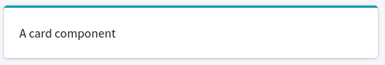

# Components

## Card

To easily integrate a card, a component is available

```html
@component('boilerplate::card')
    A card component
@endcomponent
```

And for Laravel >= 7

```html
<x-card>
    A card component
</x-card>
```

Will render



## Options

You can set card title and color by passing options to the component :

```html
@component('boilerplate::card', ['title' => "Card title", "color" => "red"])
    Card content
@endcomponent
```

or for Laravel >= 7

```html
<x-card title="Card title" color="red">
    Card content
</x-card>
```

Available colors are : black, blue, green, cyan, yellow, red, gray-dark, gray, indigo, navy, purple, fuchsia, pink, maroon, orange, lime, teal, olive

See : [https://adminlte.io/docs/3.0/layout.html](https://adminlte.io/docs/3.0/layout.html)

## Slots

You can set a specific header and / or footer with slots :

```html
@component('boilerplate::card')
    @slot('header')
        Card header content
    @endslot
    Card content
    @slot('footer')
        Card footer content
    @endslot
@endcomponent
```

or for Laravel >= 7

```html
<x-card>
    <x-slot name="header">
        Card header content
    </x-slot>
    Card content
    <x-slot name="footer">
        Card footer content
    </x-slot>
</x-card>
```

## Tabs

For tabs cards, you have to set tabs option :

```html
@component('boilerplate::card', ['tabs' => true])
    @slot('header')
        <ul class="nav nav-tabs" id="custom-tabs-two-tab" role="tablist">
            <li class="nav-item">
                <a class="nav-link active" id="tab1-tab" data-toggle="pill" href="#tab1" role="tab" aria-controls="custom-tabs-two-home" aria-selected="true">Tab 1</a>
            </li>
            <li class="nav-item">
                <a class="nav-link" id="tab2-tab" data-toggle="pill" href="#tab2" role="tab" aria-controls="custom-tabs-two-profile" aria-selected="false">Tab 2</a>
            </li>
        </ul>
    @endslot
    <div class="tab-content" id="custom-tabs-two-tabContent">
        <div class="tab-pane fade show active" id="tab1" role="tabpanel" aria-labelledby="tab1-tab">
            Tab 1 content
        </div>
        <div class="tab-pane fade" id="tab2" role="tabpanel" aria-labelledby="tab2-tab">
            Tab 2 content
        </div>
    </div>
@endcomponent
```

or for Laravel >= 7

```html
<x-card tabs="true">
    <x-slot name="header">
        <ul class="nav nav-tabs" id="custom-tabs-two-tab" role="tablist">
            <li class="nav-item">
                <a class="nav-link active" id="tab1-tab" data-toggle="pill" href="#tab1" role="tab" aria-controls="custom-tabs-two-home" aria-selected="true">Tab 1</a>
            </li>
            <li class="nav-item">
                <a class="nav-link" id="tab2-tab" data-toggle="pill" href="#tab2" role="tab" aria-controls="custom-tabs-two-profile" aria-selected="false">Tab 2</a>
            </li>
        </ul>
    </x-slot>
    <div class="tab-content" id="custom-tabs-two-tabContent">
        <div class="tab-pane fade show active" id="tab1" role="tabpanel" aria-labelledby="tab1-tab">
            Tab 1 content
        </div>
        <div class="tab-pane fade" id="tab2" role="tabpanel" aria-labelledby="tab2-tab">
            Tab 2 content
        </div>
    </div>
</x-card>
```