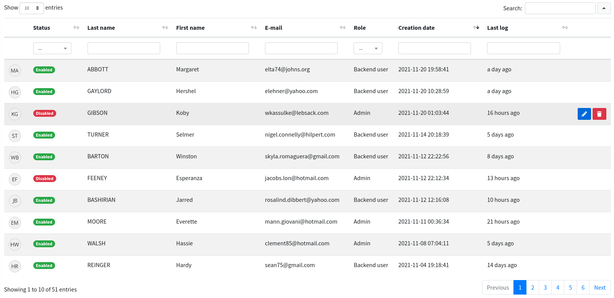

# DataTable

```html
<x-boilerplate::datatable name="users" />
```

Will render



## How to create a DataTable

[See the dedicated documentation](../datatables/)

## Laravel 6

Laravel 6 does not support Blade x components, but you can use the `@component` directive instead :

```html
@component('boilerplate::datatable', ['name' => 'users']) @endcomponent
```