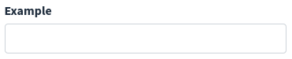
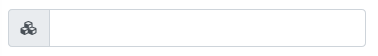
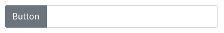

# Input

```html
<x-boilerplate::input name="example" label="Example" />
```

Or for Laravel 6

```html
@component('boilerplate::input', ['name' => 'example', 'label' => 'Example']) @endcomponent
```

Will render



## Attributes

Attributes that can be used with this component :

| Option | Type | Default | Description |
| --- | --- | --- | --- |
| name | string | null | Input name (required) |
| type | string | text | Type of input, can be text, email, password, file, number, date and select |
| label | string | name | Input label, can be a translation string |
| help | string | null | Help message that will be displayed under the input field |
| value | mixed | null | Value of input |
| options | array | [] | For select, array of options |
| prepend-text | string | Empty string | Text that will be added on the left side of the input, see "Append / Prepend" below | 
| append-text | string | Empty string | Text that will be added on the right side of the input, see "Append / Prepend" below | 

All of the attributes that are not in the list above will be added as attributes to the input field :

```html
<x-boilerplate::input name="example" data-toggle="tooltip" data-title="Tooltip content" />
```

**NB** : for non primitive values that not using a simple string you have to use the `:` character as a prefix :

```html
<x-boilerplate::input type="date" name="date" :value="\Carbon\Carbon::now()" :placeholder="__('stringToTranslate')"/>
<x-boilerplate::input type="select" name="select" :options="[1 => 'Option 1', 2 => 'Option 2']" />
```

## Append / Prepend

Instead of a simple text, you can use directly a FontAwesome class string, which will be converted into an icon :

```html
<x-boilerplate::input name="test" prepend-text="fas fa-cubes"/>
```



Or you can use a slot to set more complex add-on :

```html
<x-boilerplate::input name="test">
    <x-slot name="prepend">
        <button class="btn btn-secondary">Button</button>
    </x-slot>
</x-boilerplate::input>
```

