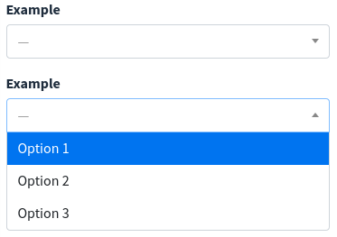

# Select2

```html
<x-boilerplate::select2 name="example" label="Example">
    <option value="1">Option 1</option>
    <option value="2">Option 2</option>
    <option value="3">Option 3</option>
</x-boilerplate::select2>
```

Or for Laravel 6

```html
@component('boilerplate::select2', ['name' => 'example', 'label' => 'Example'])
    <option value="1">Option 1</option>
    <option value="2">Option 2</option>
    <option value="3">Option 3</option>
@endcomponent
```

Will render



## Attributes

Attributes that can be used with this component :

| Option | Type | Default | Description |
| --- | --- | --- | --- |
| name | string | null | Input name (required) |
| label | string | name | Input label, can be a translation string |
| id | string | random id | Id of the input, if no value will set a unique random id |
| help | string | null | Help message that will be displayed under the input field |
| ajax | string | null | Ajax URL to call |
| multiple | boolean | false | Set to true if select is multiple |
| allow-clear | boolean | false | Set to true to allow selection clear |
| placeholder | string | "—" | The placeholder value will be displayed until a selection is made |

All of the attributes that are not in the list above will be added as attributes to the input field :

```html
<x-boilerplate::select2 name="example" data-example="example" multiple>
    <option value="1" selected>Option 1</option>
</x-boilerplate::select2>
```

**NB** : for non primitive values that not using a simple string you have to use the `:` character as a prefix :

```html
<x-boilerplate::select2 name="example" :placeholder="__('stringToTranslate')">
    <option value="1" selected>Option 1</option>
</x-boilerplate::select2>
```

## Ajax

To call in ajax a controller that will return the list of options, you can use the ajax attribute :

```html
<x-boilerplate::select2 name="example" :ajax="route('select2')">
    <option value="1" selected>Option 1</option>
</x-boilerplate::select2>
```

The controller will be called with the type "POST" and the following request parameters :

* `term` : The current search term in the search box.
* `q` : Contains the same contents as term.
* `_type`: A "request type". Will usually be query, but changes to query_append for paginated requests.
* `page` : The current page number to request. Only sent for paginated (infinite scrolling) searches.

The controller must return selectable options in json format with this structure :

```json
{
  "results": [
    {
      "id": 1,
      "text": "Option 1"
    },
    {
      "id": 2,
      "text": "Option 2"
    }
  ]
}
```

Have a look to the Select2 official documentation : [https://select2.org/data-sources/ajax](https://select2.org/data-sources/ajax)