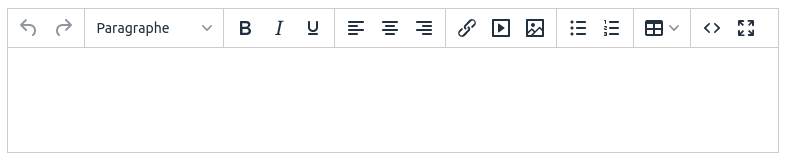

# TinyMCE

```html
<x-boilerplate::tinymce name="html" />
```

Will render



> If you have installed the package [sebastien/boilerplate-media-manager](https://github.com/sebastienheyd/boilerplate-media-manager), the media manager will be automatically added to TinyMCE for images and documents.

## Value

The value can be set by using slot or the value attribute

```html
<x-boilerplate::tinymce name="example">
    <h2>TinyMCE demo</h2><p>Lorem ipsum dolor sit amet.</p>
</x-boilerplate::tinymce>
```

or

```html
<x-boilerplate::tinymce name="example" value="<h2>TinyMCE demo</h2><p>Lorem ipsum dolor sit amet.</p>" />
```

## Attributes

For all non primitive values that not using a simple string you have to use the `:` character as a prefix :

```html
<x-boilerplate::tinymce id="example" name="example" :value="$content" />
```

## Laravel 6

Laravel 6 does not support Blade x components, but you can use the `@component` directive instead :

```html
@component('boilerplate::tinymce') @endcomponent
```