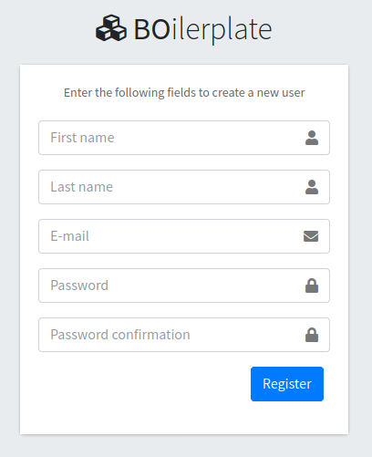
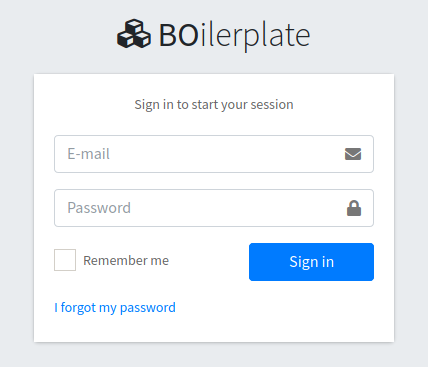
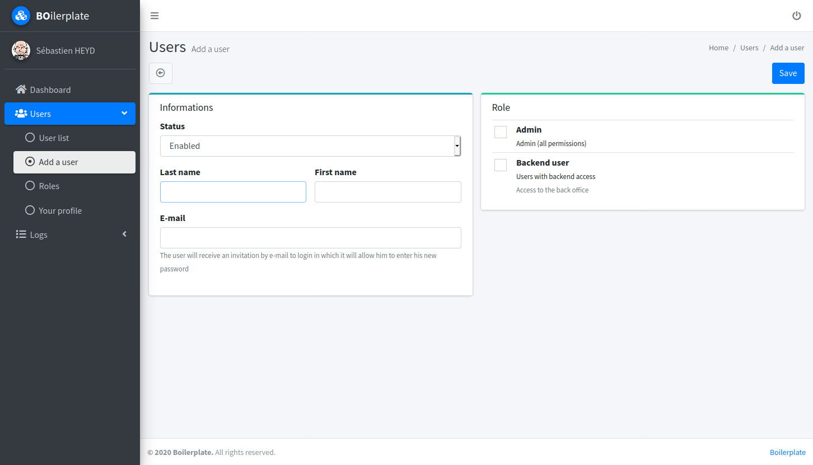
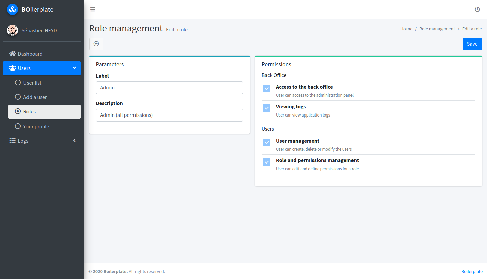
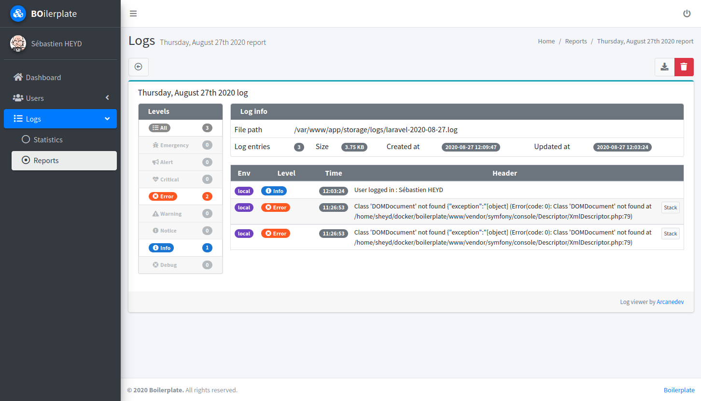

# Laravel / AdminLTE 3 Boilerplate

This package serves as a basis for quickly creating a back-office. 
It includes profile creation and his management, user management, roles, permissions and log viewing.

It also makes it easy to add other packages to extend the features, have a look to
[sebastienheyd/boilerplate-packager](https://github.com/sebastienheyd/boilerplate-packager) to quickly build your own
package for boilerplate.

Other packages to extend the features :
* [sebastienheyd/boilerplate-media-manager](https://github.com/sebastienheyd/boilerplate-media-manager)
* [sebastienheyd/boilerplate-email-editor](https://github.com/sebastienheyd/boilerplate-email-editor)

---

## Features

* Configurable backend theme [AdminLTE 3](https://adminlte.io/docs/3.0/)
* Css framework [Bootstrap 4](https://getbootstrap.com/)
* Icons by [Font Awesome 5](https://fontawesome.com/)
* Role-based permissions provided by [santigarcor/laratrust](https://github.com/santigarcor/laratrust)
* Forms & Html helpers by [laravelcollective/html](https://github.com/laravelcollective/html)
* Menu dynamically builded by [lavary/laravel-menu](https://github.com/lavary/laravel-menu)
* Menu items activated by [hieu-le/active](https://github.com/letrunghieu/active)
* Server-side datatables methods provided by [yajra/laravel-datatables](https://github.com/yajra/laravel-datatables)
* Image manipulation by [intervention/image](https://github.com/intervention/image)
* Logs visualization by [arcanedev/log-viewer](https://github.com/ARCANEDEV/LogViewer)
* Gravatar import by [thomaswelton/laravel-gravatar](https://github.com/thomaswelton/laravel-gravatar)
* Laravel Blade components for AdminLTE 3
* Javascript session keep-alive
* Localized English / French / Italian / Spanish / Turkish