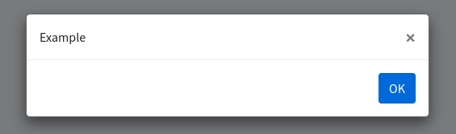

# BootBox

Bootbox.js is a small JavaScript library which allows you to create programmatic dialog boxes using Bootstrap modals, without having to worry about creating, managing, or removing any of the required DOM elements or JavaScript event handlers. 

> [http://bootboxjs.com/](http://bootboxjs.com/documentation.html) 



---

## Usage

Bootbox is loaded by default, you don't have to call any loader.

```html
@push('js']
    <script>
        bootbox.alert('Example')
    </script>
@endpush
```