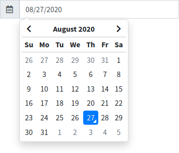
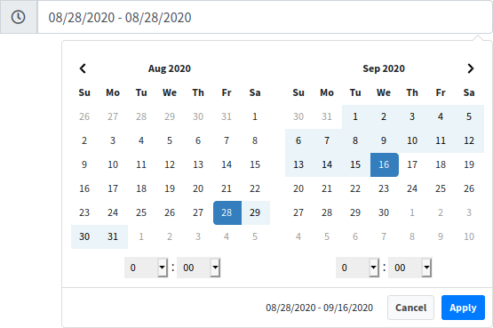

# Datepicker

Boilerplate is delivered with two JS plugins to provide date and time picker.

## Tempus Dominus

Tempus Dominus is the successor to the very popular Eonasdan/bootstrap-datetimepicker. The plugin provide a robust date and time picker designed to integrate into your Bootstrap project. 

> [https://tempusdominus.github.io/bootstrap-4](https://tempusdominus.github.io/bootstrap-4/)



## Date Range Picker

Originally created for reports at Improvely, the Date Range Picker can be attached to any webpage element to pop up two calendars for selecting dates, times, or predefined ranges like "Last 30 Days".

> [https://www.daterangepicker.com](https://www.daterangepicker.com/)



## Usage

To use date picker and/or date range picker you can use the loading view [`boilerplate::load.datepicker`](https://github.com/sebastienheyd/boilerplate/blob/e1dc4b29920f011271a1a7ad682c3e82643180d9/src/resources/views/load/datepicker.blade.php)

You can find an example of use here : [datepicker.blade.php](https://github.com/sebastienheyd/boilerplate/blob/e1dc4b29920f011271a1a7ad682c3e82643180d9/src/resources/views/plugins/demo/datepicker.blade.php)

```html
@section('content')
<input type="text" class="datepicker">
<input type="text" class="datetimepicker">
<input type="text" class="daterangepicker">
@endsection

@include('boilerplate::load.datepicker')

@push('js')
    <script>
        $('.datepicker').datetimepicker({ format: "L" });
        $('.datetimepicker').datetimepicker();
        $('.daterangepicker').daterangepicker();
    </script>
@endpush
```