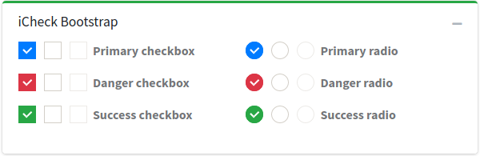

# iCheck

icheck-bootstrap is pure css solution for displaying twitter bootstrap style checkboxes and radio buttons.

> [https://github.com/bantikyan/icheck-bootstrap](https://github.com/bantikyan/icheck-bootstrap)



## Component

A Laravel Blade Component is available for iCheck, see the [component documentation](/components/icheck)

## Usage

icheck-bootstrap is loaded by default, you don't have to call any loader.

```html
<div class="icheck-primary icheck-inline">
    <input type="checkbox" id="chb1" />
    <label for="chb1">Label 1</label>
</div>
```

__No label__

```html
<div class="icheck-primary">
    <input type="checkbox" id="someCheckboxId" />
    <label for="someCheckboxId"></label>
</div>
```